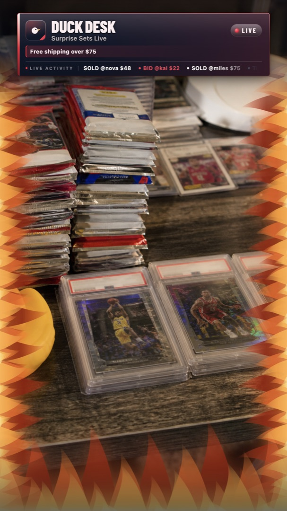
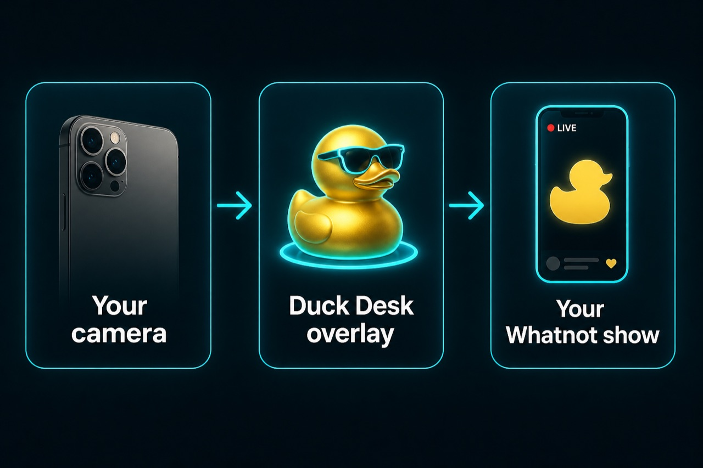
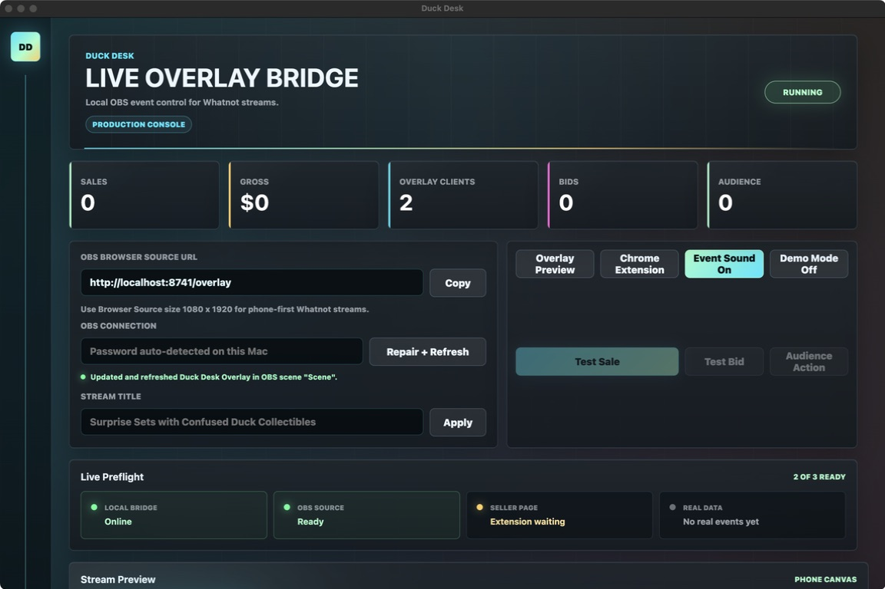
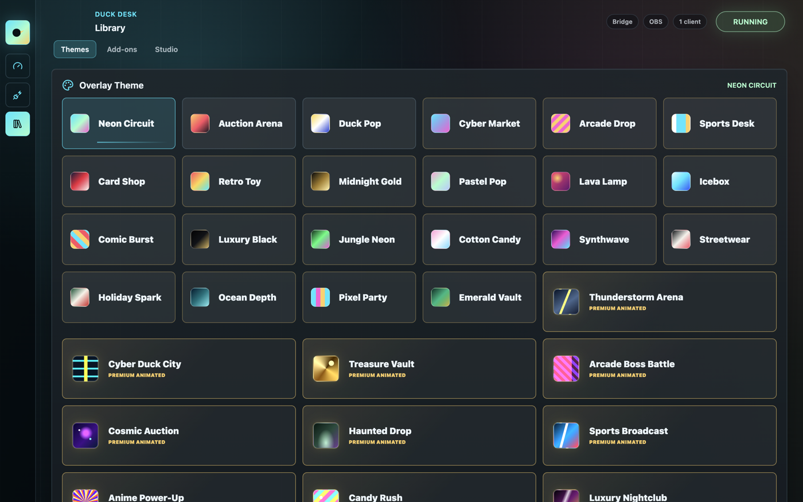
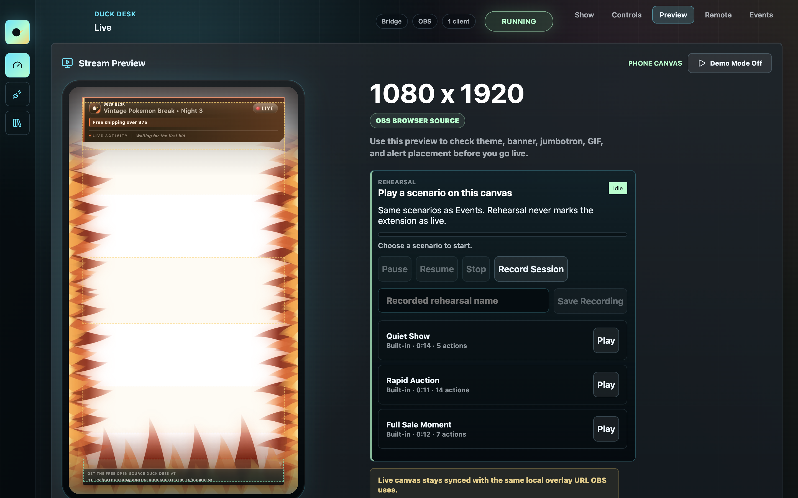

<p align="center">
  
</p>

<h1 align="center">Duck Desk</h1>

<p align="center"><strong>The free overlay for your Whatnot show.</strong></p>

<p align="center">
  Your camera stays in the middle.<br>
  Duck Desk draws the frame, alerts, and sounds around it.
</p>

<p align="center">
  <a href="https://github.com/ConfusedDuckCollectibles/DuckDesk/releases/tag/v0.1.0-alpha.5"><strong>Download for Mac</strong></a>
  &nbsp;·&nbsp;
  <a href="https://github.com/ConfusedDuckCollectibles/DuckDesk/releases/tag/v0.1.0-alpha.5"><strong>Download for Windows</strong></a>
  &nbsp;·&nbsp;
  <a href="#get-on-stream">Setup</a>
  &nbsp;·&nbsp;
  <a href="https://www.whatnot.com/user/confusedduckcollectibles">See it live</a>
</p>

<p align="center">
  Free · No account · No subscription · Runs on your computer
</p>

<p align="center">
  
</p>

<p align="center"><em>This is what buyers see. The open center is your product camera.</em></p>

> **Public alpha `v0.1.0-alpha.5`.** Download the Mac or Windows installer. You do not need Terminal, PowerShell, or any coding.

## How it works

<p align="center">
  
</p>

1. Point a phone or camera at your table.
2. Duck Desk sits on top as one transparent layer in OBS.
3. That combined picture goes out to your Whatnot show.

You do not add a new OBS source for every alert, GIF, or sound.

## See the desk

<p align="center">
  
</p>

<p align="center"><em>Live is for the show. Setup is for OBS. Library is for looks and add-ons.</em></p>

<p align="center">
  
</p>

<p align="center"><em>Pick a look in a couple of clicks. Your choice saves automatically.</em></p>

<p align="center">
  
</p>

<p align="center"><em>Check the phone canvas before you go live. It is the same overlay OBS uses.</em></p>

## Download

Most people should download a finished installer. You do not need the source code.

1. Open **[Duck Desk v0.1.0-alpha.5](https://github.com/ConfusedDuckCollectibles/DuckDesk/releases/tag/v0.1.0-alpha.5)**.
2. Scroll to **Assets**.
3. Download one file:
   - **Mac (Apple silicon):** `DuckDesk-0.1.0-alpha.5-arm64.dmg`
   - **Windows (64-bit):** `DuckDesk-0.1.0-alpha.5-windows-x64.exe`
4. Skip the `Source code` files unless you are a developer.

**Mac:** Apple menu → **About This Mac**. If **Chip** says M1, M2, M3, M4, or newer, you are set. Intel Macs are not in this alpha. The app is not Apple-notarized yet, so the first open may need a right-click.

**Windows:** 64-bit Windows 10 or 11. The installer is unsigned, so SmartScreen may say Windows protected your PC. Choose **More info**, then **Run anyway**. You do not need administrator permission.

Duck Desk does not update itself yet. When a newer build is out, install it over the current copy. Your show settings stay on this computer.

## What you get

- 56 stream looks, including 36 animated premium themes
- A live header, ticker, and vertical frame around your camera
- Sounds for bids, sales, tips, shares, and audience energy
- GIF reactions, goals, timers, scenes, and a jumbotron
- One-click OBS setup, plus a ready-check before you go live
- Automatic saving on this computer — no Duck Desk account

No cloud login. No analytics from Duck Desk. No AI features.

## What you need

- A Mac with Apple silicon, or a 64-bit Windows 10/11 PC
- [OBS Studio](https://obsproject.com/download)
- Google Chrome
- A Whatnot seller account
- A phone, webcam, or capture card
- Duck Desk open on the **same computer** as OBS while you stream

That is it. No Terminal. No PowerShell.

## Get on stream

Takes about 10 minutes the first time.

### 1. Install OBS

1. Download [OBS Studio](https://obsproject.com/download).
2. Install it, then open it.
3. If a setup wizard appears, you can close it. The next step sets the size.

### 2. Make OBS tall like a phone

1. Open OBS **Settings** (Mac: **OBS → Settings**. Windows: **File → Settings**).
2. Click **Video**.
3. Set both **Base (Canvas) Resolution** and **Output (Scaled) Resolution** to `1080x1920`.
4. Set **Common FPS Values** to `30`.
5. Click **OK**.

The canvas should look like a phone, not a TV.

### 3. Install Duck Desk

**Mac**

1. Open the `.dmg`.
2. Drag **Duck Desk** into **Applications**.
3. Open **Applications**, then open Duck Desk.
4. If macOS blocks it, right-click Duck Desk → **Open** → **Open**. You only do that once.

**Windows**

1. Open the `.exe`.
2. If SmartScreen appears, choose **More info** → **Run anyway**.
3. Finish the installer, then open Duck Desk from the Start menu.

### 4. Drop the overlay into OBS

1. Open OBS first, then Duck Desk.
2. In Duck Desk, click **Setup**, then **Connect + Add**.
3. Wait until the message turns green.
4. Click **Preflight** and confirm **OBS Source** says Ready.

If Duck Desk cannot find the OBS password:

1. In OBS, click **Tools → WebSocket Server Settings**.
2. Turn on **Enable WebSocket server**.
3. Copy the password.
4. Paste it in Duck Desk and click **Connect + Add** again.

After the first time, that button becomes **Repair + Refresh**. Use it if OBS looks one update behind.

Keep this order in the OBS Sources list:

```text
Duck Desk Overlay       top
Phone / product camera  underneath
Background              bottom
```

### 5. Add your camera

**iPhone on a Mac (easiest):** Continuity Camera.

1. Put the iPhone on a stand and plug it in.
2. Use the same Apple Account, with Wi-Fi and Bluetooth on.
3. In OBS, click **+** under Sources → **Video Capture Device** → your iPhone.
4. Resize it to fill the tall canvas.

Apple’s [Continuity Camera guide](https://support.apple.com/guide/mac-help/use-iphone-as-a-webcam-mchl77879b8a/mac) has extra help. On Windows, use a webcam, a capture card, or a phone-camera app such as DroidCam.

Any camera that shows up in OBS works.

### 6. Add the Chrome helper

This small Chrome add-on watches the Whatnot seller page you already see, then tells Duck Desk when someone bids, buys, tips, or shares.

1. In Duck Desk, click **Chrome Extension**. A folder opens.
2. In Chrome, go to `chrome://extensions`.
3. Turn on **Developer mode**.
4. Click **Load unpacked** and choose that folder.
5. Pin Duck Desk so you can see it.

Keep the seller page open on that computer while you stream. After a Duck Desk update, click the reload icon on the extension and refresh the Whatnot page once.

Tips only show if Whatnot’s tip message is visible in chat. Shares alert when the visible share count goes up.

### 7. Test before you go live

1. In Duck Desk, open **Live → Controls**.
2. Turn **Demo Mode** on.
3. Click **Test Sale**, **Test Bid**, **Test Tip**, and **Test Share**.
4. Watch the Preview tab and the OBS canvas.
5. Turn **Demo Mode** off when you are done.

Demo clicks do not change your real totals. Whatnot Rehearsal Mode is the best place to practice with real-looking activity.

### 8. Send OBS to Whatnot

1. Keep Duck Desk, OBS, and Chrome open.
2. In Chrome, open your show’s seller tools.
3. Use Whatnot’s OBS connection flow.
4. Confirm the layout is vertical, then start the show.

Whatnot’s [Using OBS with your Livestream](https://help.whatnot.com/hc/en-us/articles/5497980244749-Using-OBS-with-your-Livestream) page has the current Whatnot-side steps.

## During a show

- **Live → Show** is your scoreboard.
- **Live → Preview** is the phone canvas.
- **Setup** is OBS, stream title, and the footer checkbox.
- **Library → Themes** changes the look.
- **Library → Add-ons** turns features on.
- **Library → Studio** is where loaded add-ons live (sounds, GIFs, timers, scenes).

Your choices save by themselves. Demo Mode, live totals, and OBS passwords are not restored after a restart on purpose.

## If something is wrong

**OBS says setup is needed**  
Open OBS, then Duck Desk. Click **Connect + Add**. If needed, copy the password from OBS **Tools → WebSocket Server Settings**.

**OBS shows an old Duck Desk look**  
Click **Repair + Refresh** and wait for the green message.

**The overlay is tiny, sideways, or cropped**  
OBS **Settings → Video** should be `1080x1920` for both sizes. Right-click **Duck Desk Overlay → Transform → Fit to Screen**.

**Seller page is not connected**  
Open the Whatnot seller page in Chrome, reload the Duck Desk extension, then refresh that page.

**Tests work, but real sales do not**  
The overlay is fine. Real events need the seller page visible. Reload the extension after every Duck Desk update. If Whatnot changed its page, [open an issue](https://github.com/ConfusedDuckCollectibles/DuckDesk/issues) with the Duck Desk version. Do not share passwords, stream keys, or customer payment information.

**No sound**  
Turn **Event Sound On**. Add **Audio Studio** from the Library, press play next to a cue, and check the computer volume.

## Ready checks

| Check | Ready means |
| --- | --- |
| Local Bridge | Duck Desk is running on this computer |
| OBS Source | OBS is showing the overlay |
| Seller Page | Chrome can see your Whatnot page |
| Real Data | A real page event reached Duck Desk |

`No real events yet` is normal before the show starts. Duck Desk will not invent names or sales.

## Privacy

Duck Desk stays on your computer.

- It listens only at `127.0.0.1` on this machine.
- No Duck Desk account.
- No Duck Desk analytics.
- OBS passwords are used locally and are not saved with your show settings.
- The Chrome helper reads visible seller-page content, not passwords or hidden account data.

Duck Desk is not affiliated with or endorsed by Whatnot. Follow Whatnot’s rules and applicable laws.

## Open source

MIT licensed. Built by Confused Duck Collectibles so sellers can have a real production overlay without paying rent on it.

[Watch it on Whatnot](https://www.whatnot.com/user/confusedduckcollectibles) · [Report a problem](https://github.com/ConfusedDuckCollectibles/DuckDesk/issues) · [Contribute](CONTRIBUTING.md) · [Roadmap](ROADMAP.md) · [License](LICENSE)

<details>
<summary><strong>For developers</strong></summary>

### Requirements

- Node.js 20 or newer
- npm
- macOS to build the Apple-silicon DMG locally
- Windows to build the NSIS installer locally, or GitHub Actions

### Commands

```bash
npm install
npm run typecheck
npm run build
npm run mac:dmg    # Mac only
npm run win:nsis   # Windows only
```

Official GitHub releases build both installers in parallel. Local files land in `apps/desktop/release/` and are gitignored.

To publish: commit the version and `RELEASE_NOTES.md`, then run **Actions → Publish desktop release**. Enter the version without a leading `v`. Leave **prerelease** checked for alphas so GitHub does not try to mark it as Latest.

```bash
npm run dev:server
npm run dev:overlay
```

Development overlay: `http://localhost:5173`. Packaged overlay: `http://localhost:8741/overlay`.

```text
apps/
  desktop/    Electron app, local bridge, OBS integration
  extension/  Chrome helper for visible seller-page events
  overlay/    Vue transparent OBS overlay
  server/     Standalone local development server
packages/
  shared/     Shared event types
```

</details>
